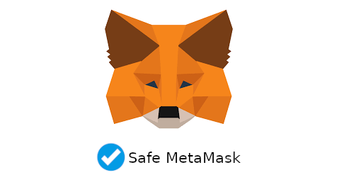

# Safe MetaMask (with real-time phishing detector) Browser Extension

Fork Improvments:
---
This would be fork of metamask that can detect pretend hack (by d-app owner or host) and phishing

In this method in adition  to website/d-app address user has to approves the website main token, too. The wallet check the token info on explorer to match website address. Also warn user if the token price is zero or not listed on sites like coinmarketcap.com

When user wants to interact with a smart contract the wallet would check deployer of the smart contract be same as creator of approved token.

Note: AI had informed metamask about these improvment in their reddit channel my post is still there (first I tried to do it in their forum proposal section but new accounts isn't able to post') but I think they prefer exchanges(swaps) happen through their wallet not websites front-end as metamask receive a commission for it

Donations:
BEP20: 0xb85a49F5E23E719e39043a945D896f54D21e42c5

Start to work after 300$

The code will be audited and my identity will be doxxed

Some other risks:
---

For Split-view-attack risk consider using these package manager & downloader:

https://github.com/kpcyrd/pacman-bintrans

https://github.com/transparencylog/tl
 
